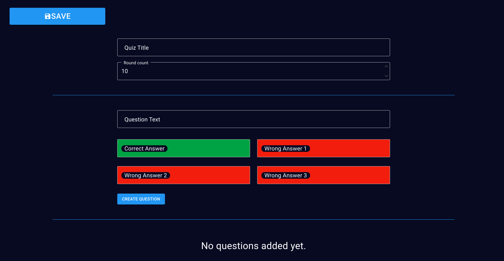

# User Documentation

## Introduction - What is QuizEdu?

QuizEdu is a web application that allows teachers to create quizzes for their students. The application is designed to be used in a classroom setting, where the teacher can create a quiz and have a selected student answer the question in front of the class.

## Pages and Features

### 1. Main menu

The main menu of the application contains the following options:

- **_Start Quiz_** - This option allows the user to start a quiz game. The user can select a quiz from the list of existing quizzes and start the game.

- **_Manage Quiz_** - This option allows the user to manage the quizzes. The user can create a new quiz or edit an existing one.

### 2. Manage Quiz

- The **_Manage Quiz_** page contains the list of existing quizzes and the option to create a new quiz or edit an existing one.
- The **_Back_** button navigates the user back to the main menu.
- The **_Create New Quiz_** button navigates the user to the **_Manage Question_** page where the user can create a new quiz.

### 3. Create New Quiz

- The **_Create New Quiz_** page contains the form for creating a new quiz. The user can enter the name of the quiz and add the questions one by one.
- After the user filled out the form, the **_Create Question_** button will create the quiz display in the list below the form. The user can add as many questions as they want.
- When adding the question the first answer is the correct one and the rest are wrong. This is also indicated by the green and red colors of the input fields.

### 4. Edit Quiz

- The **_Edit Quiz_** page contains the form for editing an existing quiz. The user can edit the name of the quiz and the questions one by one.
- The user can click to the edit button and the respective question will be displayed in the form. The user can edit the question and the answers. After the user is done editing the question, the **_Save Question_** button will save the changes and the updated question will be displayed in the list below the form.
- The user can also delete a question by clicking on the delete button next to each question.

### 5. Select Game

- The **_Select Game_** page contains the list of existing quizzes. The user can select a quiz and start the game.
- This list only contains the quizzes that have at least one question.
- The **_Back_** button navigates the user back to the main menu.

### 6. Quiz Game

- After starting the game, the user will be navigated to the **_Quiz Elements_** page. This page contains the question and the 4 answers.
- There is also a **_score counter_** in the top right corner of the page which indicates the number of correct answers and the total number of questions.
- During the game the title of the quiz is always displayed in the top left corner of the page. Here the user can also see the current round number.

#### Correct Answer

- When the user selects the correct answer, the answer will be highlighted with green color and the score counter will be updated.
- There is also a sound effect indicating that the answer was correct.

#### Wrong Answer

- When the user selects the wrong answer, the answer will be highlighted with red color and the score counter will be updated.
- There is also a sound effect indicating that the answer was wrong.
- The correct answer will be highlighted with green color.
- In this case the score counter will not be updated.

#### Endscreen

- After the user answered all the questions, the **_Endscreen_** page will be displayed.
- This page contains the final score and the option to play again.
- The **_Play Again_** button will navigate the user back to the **_Select Game_** page.
